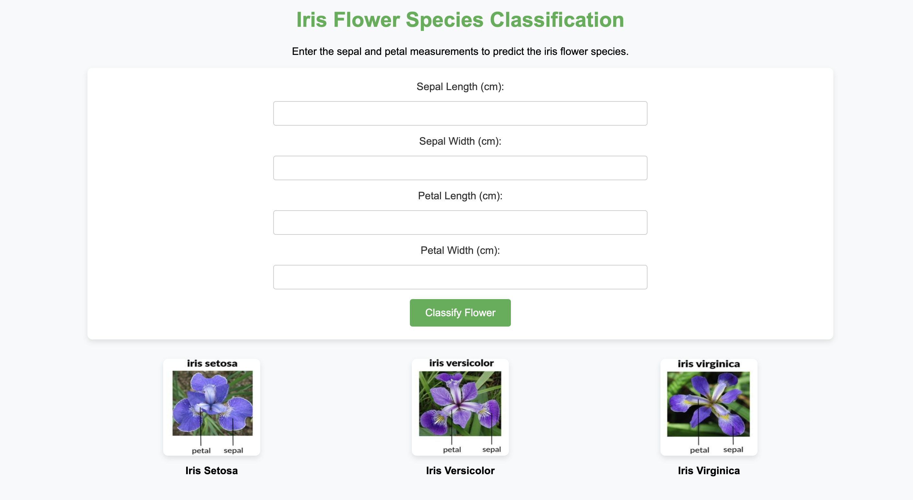
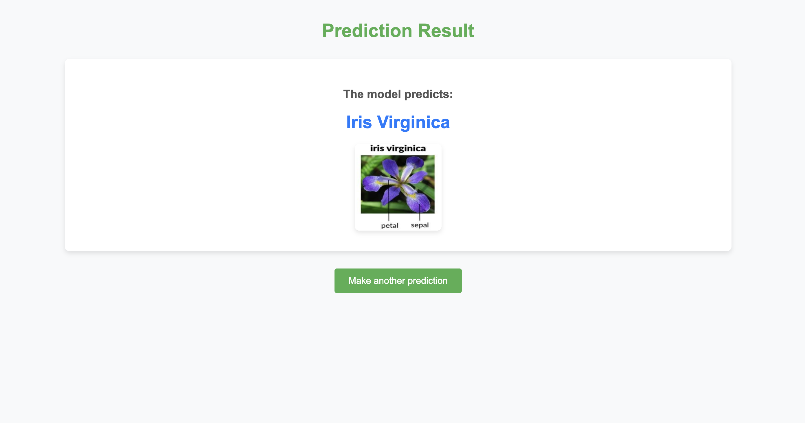

# Iris Flower Species Classification

This project is an **Iris Flower Species Classification** web application using machine learning to predict the species of Iris flowers based on their sepal and petal measurements. The web app allows users to input measurements and get the predicted flower species along with a visual representation.

## Algorithm Used

The model uses the **Random Forest Classifier**, an ensemble learning method that combines predictions from multiple decision trees to improve accuracy and reduce overfitting.

## Features

- **Sepal Length** (cm)
- **Sepal Width** (cm)
- **Petal Length** (cm)
- **Petal Width** (cm)

The dataset used to train the model consists of 150 instances, with 50 samples from each of three distinct species, and predicts one of the following Iris flower species:
1. **Iris Setosa**
2. **Iris Versicolor**
3. **Iris Virginica**


## Project Structure
```bash
Iris-flower-species-classification/
│
├── app/
│   ├── app.py          # Flask app file
│   ├── model.py        # Script for training and saving the model
│   ├── model.pkl       # Saved model file
|   ├── static          # images
│   └── templates/
│       ├── index.html  # Form page
│       └── result.html # Result page
│
├── Dockerfile          # Dockerfile for building the Docker image
├── requirements.txt    # Python dependencies
└── README.md           # Project documentation
```
## Prerequisites

- Docker
- Python

## Setup and Installation

### Running the Application with Docker

1. Clone the repository:

   ```bash
   git clone https://github.com/Betty987/Iris-flower-species-classification.git
   cd Iris-flower-species-classification

2.	Build the Docker image:

docker build -t classify .


3.	Run the Docker container:

docker run -p 5053:5053 classify


4.	Access the application:
   
Open your browser and navigate to http://127.0.0.1:5053.

### Running the Application Locally

	1.	Ensure all dependencies are installed:

pip install -r requirements.txt


	2.	Navigate to the app directory:

cd app


	3.	Run the Flask app:

python app.py


	4.	Access the application:
	•	Open your browser and navigate to http://127.0.0.1:5053.


## Usage

1. **Home Page**:
   - The home page (`index.html`) contains a form where you can input values for the model’s features.

2. **Prediction**:
   - Once you submit the form, the application processes the input using the trained machine learning model (`model.pkl`) and displays the result on the `result.html` page.

## Project Details

- **Framework**: Flask (Python)
- **Machine Learning Library**: scikit-learn
- **Deployment**: Docker

## Demo 
  
  
